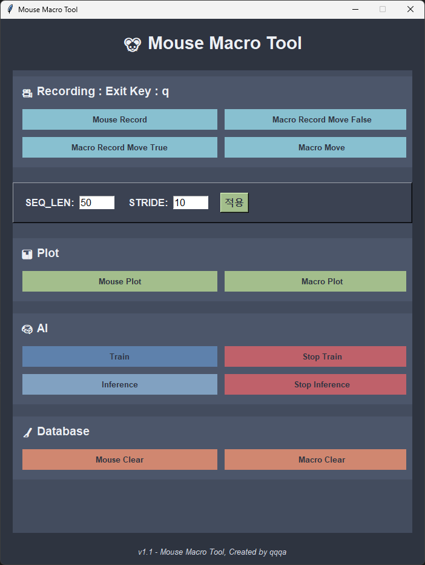
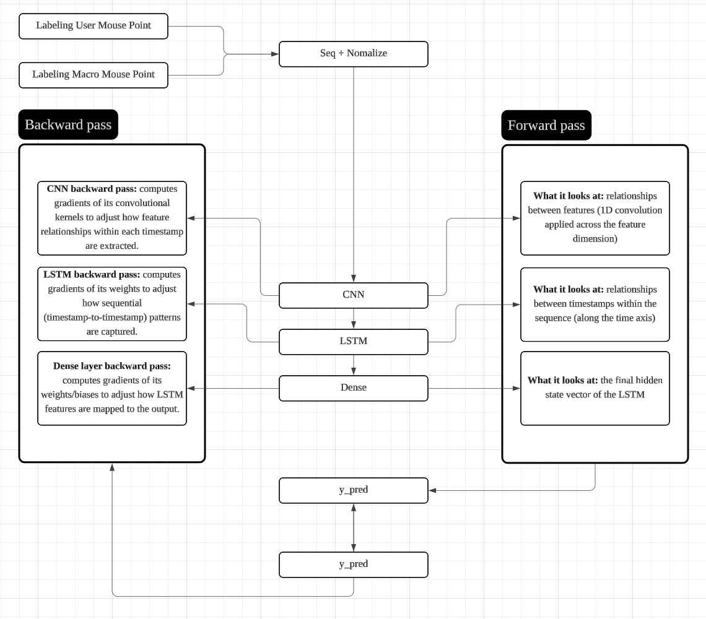

# 마우스 매크로 탐지기

## Model : DENSE +  LSTM + CNN module 복합 구조

---

# Version 1.0.2 Update
- Postgres - Json 스위칭 가능
- Json 실행시 postgres 설치 필요 없음.

- env 파일 내<br>
JsonPath=./<br>
Recorder=json<br>
추가 Recorder 기록 장소 json, postgres 또는 ui 내 토글 버튼으로 스위칭<br>

! 단 기존 env 파일 내<br>

DB_HOST=localhost<br>
DB_USER=****<br>
DB_PASSWORD=****<br>
DB_NAME=****<br>
DB_PORT=****<br>

해당 부분은 유지 => 값은 없어도 문제없습니다. 처음 불러올때 env 파일내 key부터 찾아서 key가 하나라도없으면 error가 걸립니다.
전체 내용은 ## 필수 파일 .env 확인

- json으로 기록 시 data 양이 방대하면 지연이 길어지므로 3~5만 이내 데이터만 추천드립니다.
- process 충돌로 인한 오류 수정

- User Macro도 저장되도록 버튼 추가 (User Macro Record)
- UI 깔끔하게 변경

## 실행환경
- python 3.10.9 이상
- postgres
- pgadmin(postgres db 확인용)

## 설치
pip install -r requirements.txt

## 필수파일
.env 

파일 내용

DB_HOST= type : str<br>
DB_USER= type : str<br>
DB_PASSWORD= tpye : str<br>
DB_NAME= type : str<br>
DB_PORT= type : int<br>

JsonPath=./<br>
Recorder=json<br>

SEQ_LEN : 300<br>
STRIDE : 100

## 실행
python -m ui
<br>

click main.exe

---

# UI

<br>

- Recording : Exit Key : q
  - Mouse Record : your mouse move record (timestamp, x, y)
  - Macro Record Move False : Macro Move = False Record = True
  - Macro Record Move True : Macro Move = True Reacord = True
  - Macro Mouse : Macro Move = Move, Record = False
<br>

- SEQ_LEN : Input Lstm Sequence Length
```python
# Seq_len
X = 
[
    [-3.39873314e-01 -3.44232589e-01 -1.03245652e+00 -8.37427020e-01 -7.44181825e-03 -4.44045849e-02]
    [-6.03790224e-01 -6.01908803e-01 -9.75841045e-01  3.38184461e-02 -5.67174666e-02 -3.10954526e-02]
    [-4.87755924e-01 -4.92275983e-01  5.29375315e-01  1.10766709e+00 1.84631959e-01  1.43740445e-01]
    .....
]

Y = [1, 0]
1 = user
0 = macro

# Feacture
{
    "dist",       
    "speed",      
    "acc",       
    "jerk",    
    "turn",       
    "turn_acc"   
}
```

- STRIDE : How much each sequence shifts forward
<br>

- Plot
  - User's mouse trajectory (animated)
  - Macro's mouse trajectory (animated)
<br>

- AI
  - Supervised Learning Train
  - Train: Hybrid model combining DENSE, LSTM, and CNN modules
    - input : (batch, feature, seq_len)
    - CNN : 1 dimension
    - LSTM: captures sequential/timestamp-series dependencies
    - DENSE: fully connected layers for final prediction
  - Step
    - Step 1: (batch, seq_len, feature) → (batch, feature, seq_len) (for CNN input)
    - Step 2: Extract local patterns using CNN
    - Step 3: Convert to (batch, seq_len, cnn_channels[-1]) (for LSTM input)
    - Step 4: Learn sequential patterns with LSTM
    - Step 5: Pass only the last timestamp-step output to Dense layer
    - Step 6: Compute the final output
  - Caution
    - If the stride is too small, sequences become too dense, which can prevent proper learning.

  - Role of CNN
    - Extract local patterns
    - Feature expansion / representation enhancement
    - Noise reduction & activation
  - Role of LSTM
    - Learn temporal/sequential patterns across the CNN-enhanced features
    - Capture long-range dependencies in the sequence
    - Integrate local patterns from CNN into global sequence understanding
  - Role of DENSE
    - Take the final LSTM output (usually the last timestamp-step) and map it to the desired output
    - Perform final prediction using fully connected layers
    - Combine learned features into a single output value or class probability

- AI Architecture
<br>


<br>

- Inference : Live detector
<br>

- DataBase Clear : Reset Table

---

# 현재 버그
~~inference 실행후 Macro Move 누르면 싫행됨 => q를 눌러 나갈떄 ui가 튕기지는 않는데 Macro Move의 프로세스가 문제 생김~~
~~프로세스 종료 버튼 누른 후 에는 정상적으로 실행 됨~~
~~원인은 프로세스 충돌로 예상되나 고치는데 시간이 걸리 것으로 예상됨.~~
~~그 이외에는 모두 잘 되며 해당 버그도 프로세스 오류 경고 종료 버튼 누르기만 하면 이후 기능에 영향을 끼치는 것이 아니므로 큰 문제는 없습니다.~~
수정

# 제작자
- 해당 프로그램은 마우스 위치 좌표 매크로를 사용하는 유저들을 탐지 하는 모델 입니다.
- CNN + LSTM + DENSE 모듈로 모델이 구성되어 있습니다.
- CNN은 Feacure와의 관계를 LSTM은 SEQ 내의 timestamp와의 관계를 Dense 는 LSTM의 출력 LSTM의 마지막 hidden 상태를 받아 최종 예측을 출력합니다.
순전파를 거친 후 실제 val 값과 예측값의 손실을 계산하여 역전파를 흘려 보내 Dense -> LSTM -> CNN 순으로 가중치 편향이 조정됩니다.

- 매크로 종류 유저의 마우스 이동 모션이 워낙 다양하여 적은 양의(15분 가량의 데이터) 데이터만으로 학습된 상태임에도 충분한 분별 능력을 가지고 있습니다.
- 매크로 무브먼트에 대한 움직임 이동 경로는 app.services.macroMouse에 있습니다.
해당 무브먼트를 최신 매크로들에 맞춰 움직임을 기록하고, 또한 방대한 유저의 마우스 무브먼트를 기록하여 좌표를 학습시키면 더 좋은 결과를 얻으 실 수 있으실 겁니다.
- Feacture에 대한 값은 app.core.globals 와  app.services.indicator에 있사오니 해당 부분을 수정하시어 더 좋은 피쳐로 학습시켜 보세요.
- 출력에 대한 결과값은 app.ui.inference에 있사오니 외부와 연결 하실 때 참고 부탁드립니다.

# 반드시 postgres가 설치되어있어야 하며, .env 파일이 주어진 형식에 맞게 설정되어 있어야합니다.

# 실행 영상
[](https://youtu.be/Z6v6g7pz85k)